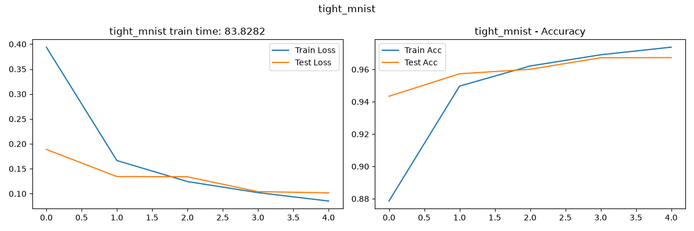
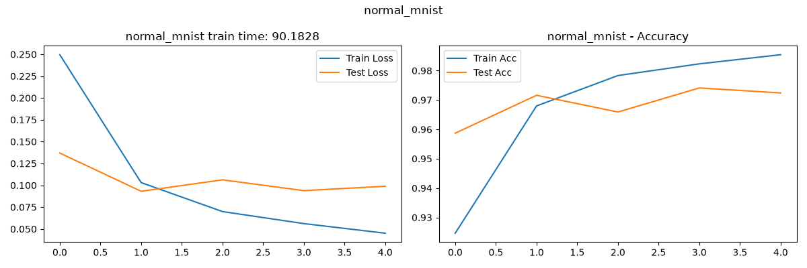
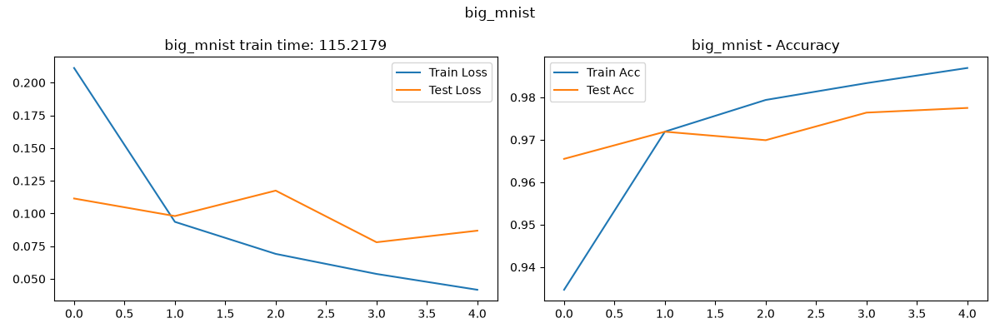
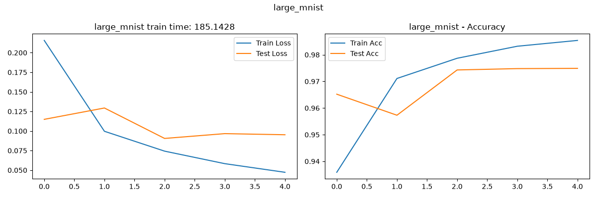
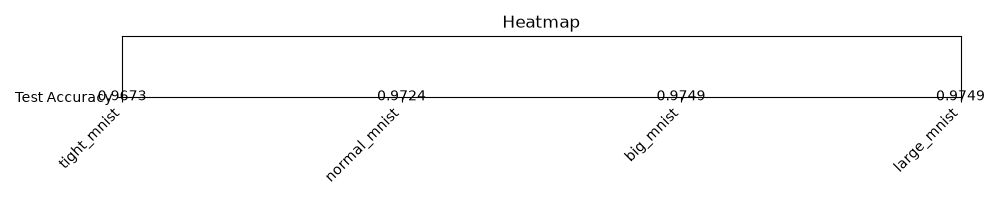
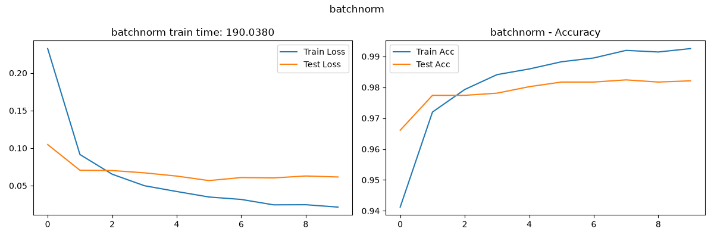
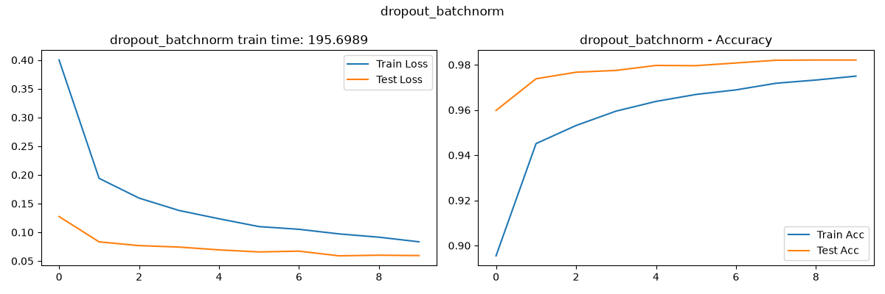

## Домашнее задание №3
### Выполнил: Анненков Арсений Алексеевич

## Задание 1: Эксперименты с глубиной сети
### 1.1 Сравнение моделей разной глубины
Время обченения растёт с увеличением количества слоёв, но нелинейно. Между пятью и семью слоями разница во времени уже небольшая.

Время обченения растёт с увеличением количества слоёв, но нелинейно.
### 1.2 Анализ переобучения
На 1-5 слоях переобучение практически незаметно, но на седьми слоях **Train Acc** превышает **Test Acc**.

Использование **Dropout и BatchNorm** влияет на время обучения, на 5ти слоях dropout увеличивает его, а batchnorm уменьшает.

3–5 слоёв	дают компромисс между точностью, переобучением и затратами времени.

## Задание 2: Эксперименты с шириной сети
### 2.1 Сравнение моделей разной ширины
С ростом ширины растёт **Train acc**. **Test acc** также растёт, однако с уровнем **big** рост почти останавливается.
Время также растёт с ростом ширины.

Из всех вариантов **tight** модель имеет самый низкий accuracy, в отличие от неё **normal, big, и large** имеют схожий уровень.

### 2.2 Оптимизация архитектуры

## Задание 3: Эксперименты с регуляризацией
### 3.1 Сравнение техник регуляризации
**Без регуляризации:** нормальное качество, но переобучение: Train Acc больше чем Test Acc, меньше устойчивости.

**Dropout:** с ростом dropout уменьшается Train Acc. Слишком сильный ухудшает обобщение.

**BatchNorm:** самый высокий показатель Train Acc, Test Acc быстро сходится.

**Dropout + BatchNorm:** ниже переобучение, но хуже обучает модель. Самый стабильный вариант, но с большей затратой времени.

**L2-регуляризация:** компромиссный вариант, простой в реализации и быстрый по времени.

### 3.2 Адаптивная регуляризация
